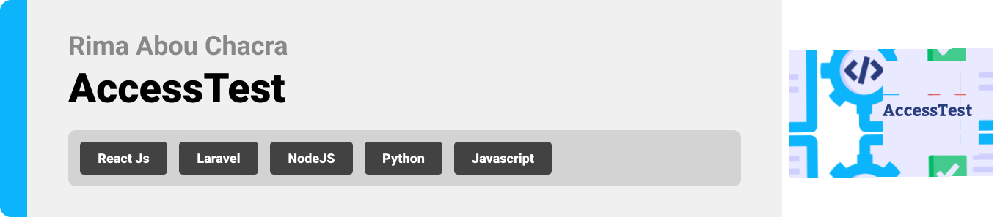
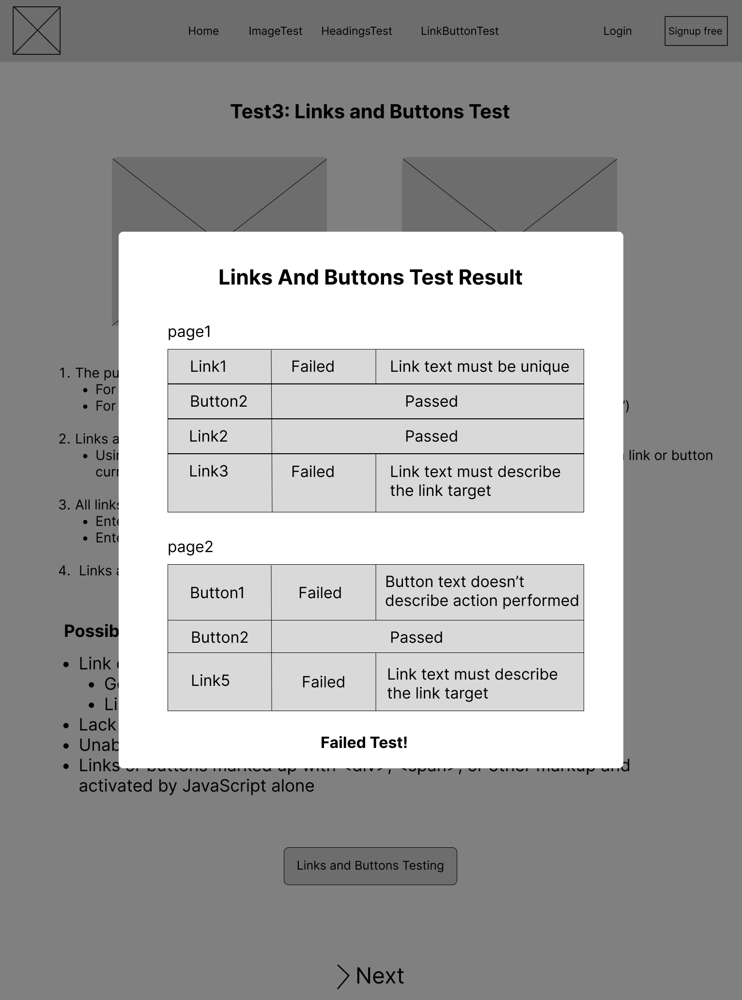
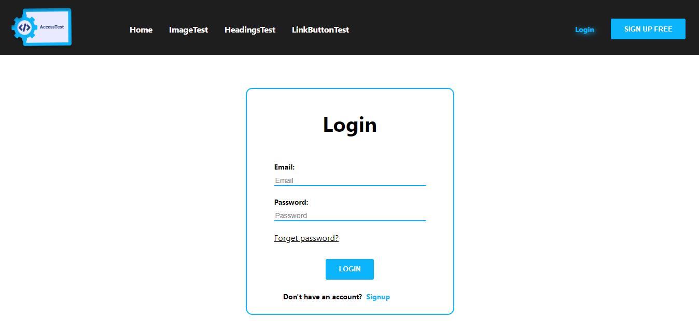

<br><br>

<!-- project philosophy -->


> A frontend website designed to help a developer test for accessibility issues on a website and log any issues that they find. The application should step the developer through the accessibility testing process, explaining each test and what to look for to decide if the webpage passes or fails the test.

>
> AccessTest aims to explain 3 main accessibility test to the developer. By providing a user-friendly website where users can see the explanation of each test.

### User Stories/User

- As a developer, I want to be able to input the URL of a website, so I can test for accessibility.
- As a developer, I want the application to guide me through the accessibility testing process step by step, so i can know any issues found.
- As a developer, I want clear explanations of each accessibility test and what to look for to determine if the webpage passes or fails the test.
- As a developer, I want the application to automatically perform basic accessibility checks, such as checking for alt attributes on images and proper heading structure.
- As a developer, I want the application to provide suggestions or resources on how to fix accessibility issues found during testing.
- As a user, I want to create an account, so that I can access the platform's features and become a part of the community.
- As a returning user, I want to be able to log in to my account, so that I can access my profile and use the platform's features.


<br><br>

<!-- Prototyping -->


> We designed AccessTest using wireframes, iterating on the design until we reached the ideal layout for easy navigation and a seamless user experience.

### Wireframes
| Login screen  | Register screen |  Landing screen |
| ---| ---| ---|
|  |  |  |

| ImageTest screen  | HeadingTest screen |  LinksButtonsTest screen |
| ---| ---| ---|
|  |  |  |

| Test1 screen  | Test2 screen |  Test3 screen |
| ---| ---| ---|
|  |  |  |

<br><br>

<!-- Implementation -->


> Using the wireframes  as a guide, we implemented AccessTest frontend website with the following features:

### User Screens (web)
| Login screen  | Register screen 
| ---| ---| 
|  |  |
| Homepage screen | ImageTest screen |
 |  |
| HeadingTest | LinkTest Screen 
|  | 


<br><br>

<!-- Tech stack -->


###  AccessTest is built using the following technologies:

- This project uses ReactJS for the frontend. ReactJS is a popular JavaScript library for building user interfaces.
- In terms of design, Rejectedly follows a simple and modern design with a focus on usability and user experience. The application uses a minimalist color palette with a clean and easy-to-use interface.

<br><br>

<!-- How to run -->


> To run AccessTest, follow these steps:

### Prerequisites

This is an example of how to list things you need to use the software and how to install them.
* npm
  ```sh
  npm install npm@latest -g
  ```

### Installation

_Below is an example of how you can instruct your audience on installing and setting up your app. This template doesn't rely on any external dependencies or services._

1. Clone the project repository
   ```sh
   git clone https://github.com/rimaabouchacra/Accessibility-Testing.git
   ```
3. For React Install NPM packages
   ```sh
   cd AccessTest-Frontend/access-test
   npm install
   ```

4. Start the server for React:

   ```sh
   cd cd AccessTest-Frontend/access-test
   npm start
   
   ```    
   

Now, you should be able to run AccessTest frontend and explore its design.